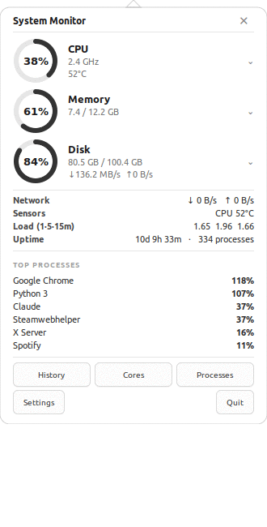
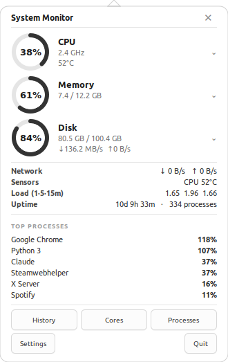
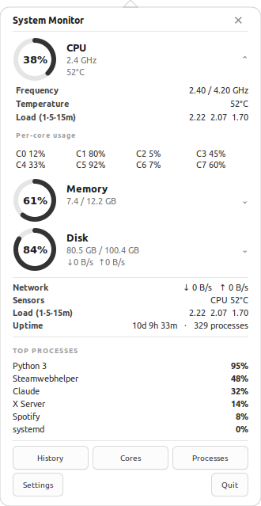
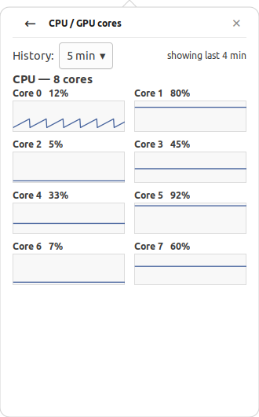
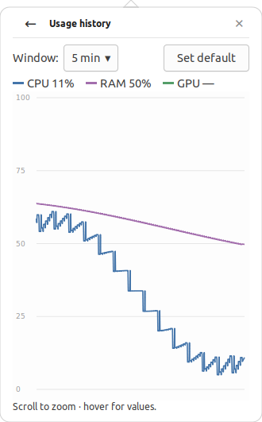
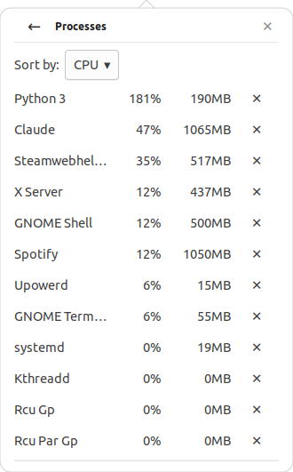

# Baro

A clean, real-time system monitor that lives in your Linux (GNOME) top bar —
inspired by the look of the macOS *Stats* app. One click shows your CPU, GPU,
RAM and disk at a glance; from there you can drill into per-core graphs, usage
history, a full process list, and more.

<p align="center">
  
</p>

---

## Features

- **Always-on tray indicator** — a small static icon plus a live, fixed-width
  `CPU 12%  RAM 40%` readout in the top bar (it never jumps around).
- **One-click menu** — clicking the icon opens a native menu with **donut
  gauges** for CPU / GPU / Memory / Disk; each row expands to a submenu with
  the exact details (frequency, temperature, per-core %, VRAM, swap, per-disk).
- **Detailed panel** — a white dropdown with big donut gauges. Every component
  is **clickable to expand in place** (cores, temps, specs) — the panel only
  ever grows downward, never sideways.
- **Drill-in views**, all in the same panel with a ← back arrow:
  - **Usage history** — CPU / RAM / GPU over a selectable window (5 min → 24 h),
    scroll to zoom, hover for exact values, gaps left blank when the machine
    was off.
  - **CPU / GPU cores** — a live graph per logical core, like Task Manager.
  - **Processes** — full list sortable by CPU / memory, with one-click kill.
  - **Disks** — every mounted disk with its own usage bar; pick which one shows
    on the main gauge.
- **Network, sensors (temps + fan RPM), load average and uptime** at a glance.
- **Fan control** (where supported) with editable fan curves.
- **Settings** — poll interval, history retention, warning thresholds, desktop
  notifications, and an animation-speed slider.

## Screenshots

| Detailed panel | Expanded component | Per-core graphs |
|---|---|---|
|  |  |  |

| Usage history | Processes |
|---|---|
|  |  |

## How to use it

1. **Click the tray icon** → the menu opens with live CPU / GPU / Memory / Disk
   gauges. Hover any of them for a submenu of exact figures.
2. Choose **Detailed panel…** for the big view, or jump straight to
   **Processes… / Usage history… / CPU&nbsp;/&nbsp;GPU&nbsp;cores…**.
3. In the detailed panel:
   - Click a **CPU / GPU / Memory / Disk** row to **expand it in place**.
   - Use the footer buttons — **History · Cores · Processes · Settings · Quit**.
   - Click **Uptime** to jump to the process list; the **★** next to a disk
     makes it the one shown on the main gauge.
4. Any drill-in has a **← back arrow** that returns to the detailed panel.
   Click another window and the panel auto-hides.

## Install

> Requires a Linux desktop with **GNOME** and the **AppIndicator** extension
> (the installer sets this up). Tested on Ubuntu.

```bash
git clone https://github.com/kamenlevi/baro.git
cd baro
./install.sh          # installs deps, a `baro` launcher, and autostart
baro                # start it (open a new terminal first if needed)
```

If the tray icon doesn't appear, enable the AppIndicator extension and log out
and back in:

```bash
sudo apt install gnome-shell-extension-appindicator
gnome-extensions enable ubuntu-appindicators@ubuntu.com
```

### Run from source (no install)

```bash
pip3 install psutil pycairo pynvml      # pynvml only needed for NVIDIA GPUs
sudo apt install python3-gi python3-gi-cairo gir1.2-gtk-3.0 \
    gir1.2-ayatanaappindicator3-0.1 gir1.2-notify-0.7 lm-sensors
./run.sh
```

## Requirements

- Python 3, GTK 3 (PyGObject), PyCairo
- `psutil` — CPU / memory / disk / network / processes
- `pynvml` — optional, for NVIDIA GPU stats
- `lm-sensors` — temperatures and fans
- GNOME with an AppIndicator/KStatusNotifier extension for the tray icon

## Notes & limitations

- The tray menu is rendered by GNOME, so it's a native menu (the big graphical
  panel opens from it). On GNOME a tray left-click can only open a menu, not a
  window directly — that's why the gauges live in the menu and the rich panel
  is one entry away.
- Per-shader-core **GPU** usage isn't exposed on Linux, so the GPU is shown as
  overall utilisation + VRAM rather than per-core.

## License

Personal project by [@kamenlevi](https://github.com/kamenlevi).
